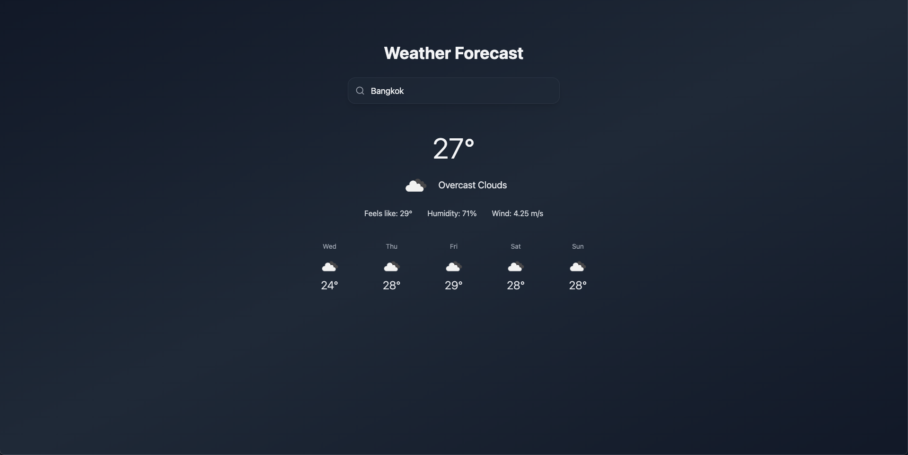

# Modern Weather App

A sleek and modern weather application built with Next.js and Tailwind CSS. Get real-time weather information and forecasts for any city worldwide with an intuitive dark-themed interface.



## Features

- 🌡️ Real-time weather data and 5-day forecast
- 🏙️ Smart city search with autocomplete
- 🌓 Dark mode interface for comfortable viewing
- 🎨 Modern, responsive design with smooth animations
- 🔍 Intelligent search suggestions with population data
- 📱 Mobile-friendly interface

## Technologies Used

- [Next.js](https://nextjs.org/) - React framework for production
- [Tailwind CSS](https://tailwindcss.com/) - Utility-first CSS framework
- [OpenWeather API](https://openweathermap.org/api) - Weather data provider
- [GeoDB Cities API](https://rapidapi.com/wirefreethought/api/geodb-cities/) - City search and suggestions
- [React Icons](https://react-icons.github.io/react-icons/) - Icon components

## Getting Started

### Prerequisites

- Node.js 14.0 or later
- npm or yarn package manager

### Installation

1. Clone the repository:

```bash
git clone <your-repo-url>
cd weather-app
```

2. Install dependencies:

```bash
npm install
# or
yarn install
```

3. Create a `.env.local` file in the root directory and add your API keys:

```env
API_KEY=your_openweather_api_key
RAPID_API_KEY=your_geodb_api_key
```

4. Start the development server:

```bash
npm run dev
# or
yarn dev
```

5. Open [http://localhost:3000](http://localhost:3000) in your browser to see the application.

## Environment Variables

The following environment variables are required:

- `API_KEY` - OpenWeather API key
- `RAPID_API_KEY` - RapidAPI key for GeoDB Cities API

## Usage

1. Enter a city name in the search bar
2. Select a city from the autocomplete suggestions
3. View current weather conditions and 5-day forecast
4. Enjoy the responsive dark theme interface

## Project Structure

```
weather-app/
├── src/
│   ├── components/
│   │   ├── SearchBar.js
│   │   └── WeatherDisplay.js
│   ├── pages/
│   │   ├── api/
│   │   │   ├── cities.js
│   │   │   └── weather.js
│   │   ├── _app.js
│   │   └── index.js
│   └── utils/
│       └── api.js
├── public/
├── styles/
│   └── globals.css
└── tailwind.config.js
```

## API Integration

The app uses two main APIs:

1. **OpenWeather API**

   - Provides current weather data
   - 5-day weather forecast
   - Weather icons and descriptions

2. **GeoDB Cities API**
   - City search with autocomplete
   - Population data
   - Geographic information

## Contributing

Contributions are welcome! Please feel free to submit a Pull Request.

## License

This project is licensed under the MIT License - see the [LICENSE](LICENSE) file for details.

## Acknowledgments

- Weather data provided by [OpenWeather](https://openweathermap.org/)
- City data provided by [GeoDB Cities](https://rapidapi.com/wirefreethought/api/geodb-cities/)
- Icons from [React Icons](https://react-icons.github.io/react-icons/)
